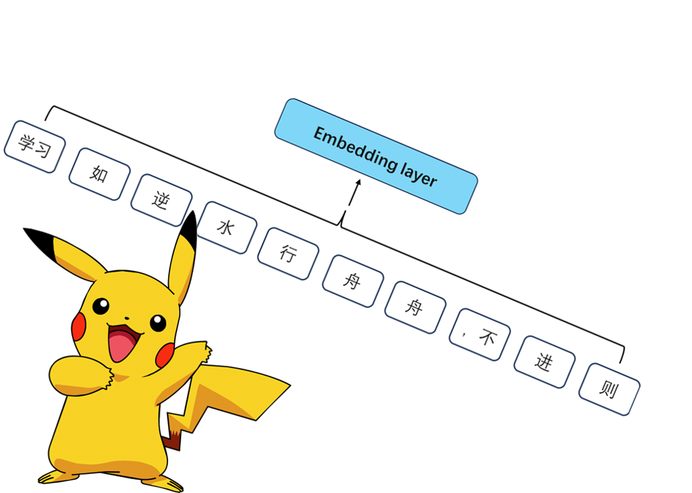

# Deconstructing QWen2 from the Ground Up
[中文版]([Chinese V.ipynb](https://github.com/Ginjing-Yuan/QWen2-from_ground_up/blob/main/Chinese%20V.ipynb))

In this project, I will demonstrate how to deconstruct QWen2 from scratch. Specifically, I will explore how to complete a Chinese proverb which is generating a "退" from the input input_text="学习如逆水行舟，不进则". I hope this project will help everyone gain a better understanding of the structure of QWen2, and also want to take this opportunity to promote China's LLM.

Here is the offical link to download the weights: https://www.modelscope.cn/models/qwen/Qwen2-7B/files

<div>
    
</div>

## tokenizer
Here, I'm not going to show the principle and implementation of LLM's tokenizer. Andrej Karpathy has provided a one-to-one implementation of GPT4Tokenizer. His code is really easy to understand!!!

<div>
    
</div>


```python
import torch
import json
import matplotlib.pyplot as plt
import math
from torch import nn
import torch
from transformers import AutoModelForCausalLM, AutoTokenizer
```
```python
# To ensure every layer's output is same with model.generate(). The model should be load in precision of torch.float32!
model_path="Qwen/Qwen2-7B"

tokenizer=AutoTokenizer.from_pretrained(model_path)
model = AutoModelForCausalLM.from_pretrained(model_path, torch_dtype=torch.float32)
```


## Reading the model file
Normally, we can use LLM to inference text by run the entire model.
However, this project is going to show the structure of QWen2, so I will run the martrix in model layer by layer.

<div>
    
</div>


```python
model = model.state_dict()
print(json.dumps(list(model.keys())[:20], indent=4))
```

[
    "model.embed_tokens.weight",
    "model.layers.0.self_attn.q_proj.weight",
    "model.layers.0.self_attn.q_proj.bias",
    "model.layers.0.self_attn.k_proj.weight",
    "model.layers.0.self_attn.k_proj.bias",
    "model.layers.0.self_attn.v_proj.weight",
    "model.layers.0.self_attn.v_proj.bias",
    "model.layers.0.self_attn.o_proj.weight",
    "model.layers.0.mlp.gate_proj.weight",
    "model.layers.0.mlp.up_proj.weight",
    "model.layers.0.mlp.down_proj.weight",
    "model.layers.0.input_layernorm.weight",
    "model.layers.0.post_attention_layernorm.weight",
    "model.layers.1.self_attn.q_proj.weight",
    "model.layers.1.self_attn.q_proj.bias",
    "model.layers.1.self_attn.k_proj.weight",
    "model.layers.1.self_attn.k_proj.bias",
    "model.layers.1.self_attn.v_proj.weight",
    "model.layers.1.self_attn.v_proj.bias",
    "model.layers.1.self_attn.o_proj.weight"
]


```python
with open("Qwen2-7B/config.json", "r") as f:
    config = json.load(f)
config
```


{'architectures': ['Qwen2ForCausalLM'],
 'attention_dropout': 0.0,
 'bos_token_id': 151643,
 'eos_token_id': 151643,
 'hidden_act': 'silu',
 'hidden_size': 3584,
 'initializer_range': 0.02,
 'intermediate_size': 18944,
 'max_position_embeddings': 131072,
 'max_window_layers': 28,
 'model_type': 'qwen2',
 'num_attention_heads': 28,
 'num_hidden_layers': 28,
 'num_key_value_heads': 4,
 'rms_norm_eps': 1e-06,
 'rope_theta': 1000000.0,
 'sliding_window': 131072,
 'tie_word_embeddings': False,
 'torch_dtype': 'bfloat16',
 'transformers_version': '4.37.2',
 'use_cache': True,
 'use_sliding_window': False,
 'vocab_size': 152064}


## We will use these configs to assemble the QWen2
1. 28 transformer layers
2. 28 attention heads
3. 4 kv heads and so on.


```python
dim = config["hidden_size"]
n_layers = config["num_hidden_layers"]
n_heads = config["num_attention_heads"]
n_kv_heads = config["num_key_value_heads"]
vocab_size = config["vocab_size"]
norm_eps = config["rms_norm_eps"]
rope_theta = torch.tensor(config["rope_theta"])
```

## Convert text to tokens
I'm going to use QWen2's build-in tokenizer to do presentation.

You may be confused why "学习" and "，不" is in one token (consider the principle of bpe). Later, some other Chinese characters maybe represented by two or more tokens like "炊".
<div>
    
</div>


```python
prompt = "学习如逆水行舟，不进则"
tokens = tokenizer.encode(prompt)
q_len = len(tokens)
tokenizer.decode(tokens)
```

'学习如逆水行舟，不进则'


```python
tokens = torch.tensor(tokens)
embedding_layer = torch.nn.Embedding.from_pretrained(model['model.embed_tokens.weight'])
token_embeddings_unnormalized = embedding_layer(tokens)
token_embeddings_unnormalized.shape
```


    torch.Size([10, 3584])


## Normalize the embedding using rms normalization
RMS normalization (Root Mean Square normalization) is used in the embedding layers of Large Language Models (LLMs) for several reasons:
1. Stabilizing Training
2. Improving Convergence
3. Better Generalization
4. Handling Variability in Embedding Magnitudes

It's worth noting that we need to set a norm_eps to avoid the formula dived by 0.

<div>
    
</div>


```python
def rms_norm(tensor, norm_weights):
    return (tensor * torch.rsqrt(tensor.pow(2).mean(-1, keepdim=True) + norm_eps)) * norm_weights
```

# Build the first transformer layer
### Normalization
You can see, after through layer0 from the dict extract from the model.

The output tensor is still shape in [10*3584] but normalized.

<div>
    
</div>


```python
token_embeddings = rms_norm(token_embeddings_unnormalized, model["model.layers.0.input_layernorm.weight"])
token_embeddings.shape
```


    torch.Size([10, 3584])


## Assemble attention from scratch
Load the attention heads of the first layer of transformer.

<div>
    
</div>


```python
q_layer0 = model["model.layers.0.self_attn.q_proj.weight"]
k_layer0 = model["model.layers.0.self_attn.k_proj.weight"]
v_layer0 = model["model.layers.0.self_attn.v_proj.weight"]
o_layer0 = model["model.layers.0.self_attn.o_proj.weight"]
q_layer0_bias = model['model.layers.0.self_attn.q_proj.bias']
k_layer0_bias = model['model.layers.0.self_attn.k_proj.bias']
v_layer0_bias = model['model.layers.0.self_attn.v_proj.bias']
```


## Now, we recive the query, key, and value for the token
Their shape is [10*3584], which 10 is the length of embedding tokens and 3584 is dimension of hidden state.


```python
query_states = torch.matmul(token_embeddings, q_layer0.T)+q_layer0_bias
key_states = torch.matmul(token_embeddings, k_layer0.T)+k_layer0_bias
value_states = torch.matmul(token_embeddings, v_layer0.T)+v_layer0_bias
head_dim = dim//n_heads
query_states = query_states.view(1, q_len, n_heads, head_dim).transpose(1, 2)
key_states = key_states.view(1, q_len, n_kv_heads, head_dim).transpose(1, 2)
value_states = value_states.view(1, q_len, n_kv_heads, head_dim).transpose(1, 2)
```


## Positioning encoding
Due to query, key, and value can not represent the position information of tokens. Transformers are designed to handle sequences of data, but unlike recurrent neural networks (RNNs), they do not process the data in a sequential order. Positional encoding addresses this by adding information about the position of each token in the sequence, enabling the model to understand the order and relative position of tokens.

### RoPE
watch this video (this is what i watched) to understand the math.
**https://www.youtube.com/watch?v=o29P0Kpobz0&t=530s**

### Here I use the original positional encoding code from QWen2
Qwen2RotaryEmbedding() is used to generate rotating position encoding to efficiently provide position encoding for input sequences by calculating and caching cosine and sine values.


```python
class Qwen2RotaryEmbedding(nn.Module):
    def __init__(self, dim, max_position_embeddings=2048, base=10000, device=None):
        super().__init__()

        self.dim = dim
        self.max_position_embeddings = max_position_embeddings
        self.base = base
        inv_freq = 1.0 / (self.base ** (torch.arange(0, self.dim, 2, dtype=torch.int64).float().to(device) / self.dim))
        self.register_buffer("inv_freq", inv_freq, persistent=False)

        # Build here to make `torch.jit.trace` work.
        self._set_cos_sin_cache(
            seq_len=max_position_embeddings, device=self.inv_freq.device, dtype=torch.get_default_dtype()
        )

    def _set_cos_sin_cache(self, seq_len, device, dtype):
        self.max_seq_len_cached = seq_len
        t = torch.arange(self.max_seq_len_cached, device=device, dtype=torch.int64).type_as(self.inv_freq)

        freqs = torch.outer(t, self.inv_freq)
        # Different from paper, but it uses a different permutation in order to obtain the same calculation
        emb = torch.cat((freqs, freqs), dim=-1)
        self.register_buffer("cos_cached", emb.cos().to(dtype), persistent=False)
        self.register_buffer("sin_cached", emb.sin().to(dtype), persistent=False)

    def forward(self, x, seq_len=None):
        # x: [bs, num_attention_heads, seq_len, head_size]
        if seq_len > self.max_seq_len_cached:
            self._set_cos_sin_cache(seq_len=seq_len, device=x.device, dtype=x.dtype)

        return (
            self.cos_cached[:seq_len].to(dtype=x.dtype),
            self.sin_cached[:seq_len].to(dtype=x.dtype),
        )
rotary_emb = Qwen2RotaryEmbedding(
            128,
            max_position_embeddings=131072,
            base=rope_theta,
        )
```


## apply_rotary_pos_emb(q, k, cos, sin, position_ids, unsqueeze_dim=1)
By combining query and key tensors with cosine and sine values, including rotation operations, positional coding information is embedded in the query and key tensors.
## rotate_half(x)
This rotation operation allows each element of the vector to be combined with the cosine and sine values of the corresponding position, thereby changing the direction and amplitude of the vector.

```python
def apply_rotary_pos_emb(q, k, cos, sin, position_ids, unsqueeze_dim=1):
    """Applies Rotary Position Embedding to the query and key tensors.

    Args:
        q (`torch.Tensor`): The query tensor.
        k (`torch.Tensor`): The key tensor.
        cos (`torch.Tensor`): The cosine part of the rotary embedding.
        sin (`torch.Tensor`): The sine part of the rotary embedding.
        position_ids (`torch.Tensor`):
            The position indices of the tokens corresponding to the query and key tensors. For example, this can be
            used to pass offsetted position ids when working with a KV-cache.
        unsqueeze_dim (`int`, *optional*, defaults to 1):
            The 'unsqueeze_dim' argument specifies the dimension along which to unsqueeze cos[position_ids] and
            sin[position_ids] so that they can be properly broadcasted to the dimensions of q and k. For example, note
            that cos[position_ids] and sin[position_ids] have the shape [batch_size, seq_len, head_dim]. Then, if q and
            k have the shape [batch_size, heads, seq_len, head_dim], then setting unsqueeze_dim=1 makes
            cos[position_ids] and sin[position_ids] broadcastable to the shapes of q and k. Similarly, if q and k have
            the shape [batch_size, seq_len, heads, head_dim], then set unsqueeze_dim=2.
    Returns:
        `tuple(torch.Tensor)` comprising of the query and key tensors rotated using the Rotary Position Embedding.
    """
    cos = cos[position_ids].unsqueeze(unsqueeze_dim)
    sin = sin[position_ids].unsqueeze(unsqueeze_dim)
    q_embed = (q * cos) + (rotate_half(q) * sin)
    k_embed = (k * cos) + (rotate_half(k) * sin)
    return q_embed, k_embed


def rotate_half(x):
    """Rotates half the hidden dims of the input."""
    x1 = x[..., : x.shape[-1] // 2]
    x2 = x[..., x.shape[-1] // 2 :]
    return torch.cat((-x2, x1), dim=-1)
cos, sin = rotary_emb(value_states, seq_len=q_len)
position_ids = torch.arange(q_len).view(1,q_len)
query_states, key_states = apply_rotary_pos_emb(query_states, key_states, cos, sin, position_ids)
def repeat_kv(hidden_states: torch.Tensor, n_rep: int) -> torch.Tensor:
    """
    This is the equivalent of torch.repeat_interleave(x, dim=1, repeats=n_rep). The hidden states go from (batch,
    num_key_value_heads, seqlen, head_dim) to (batch, num_attention_heads, seqlen, head_dim)
    """
    batch, num_key_value_heads, slen, head_dim = hidden_states.shape
    if n_rep == 1:
        return hidden_states
    hidden_states = hidden_states[:, :, None, :, :].expand(batch, num_key_value_heads, n_rep, slen, head_dim)
    return hidden_states.reshape(batch, num_key_value_heads * n_rep, slen, head_dim)
key_states = repeat_kv(key_states, n_heads // n_kv_heads)
value_states = repeat_kv(value_states, n_heads // n_kv_heads)
```


## Scaled Dot-Product Attention
This is a core attention mechanism in the Transformer architecture that allows the model to dynamically adjust its focus to different locations based on correlations in the input sequence. Specifically, this function performs dot product attention calculations on query, key, and value tensors.

<div>
    
</div>


```python
attn_output = torch.nn.functional.scaled_dot_product_attention(
    query_states,
    key_states,
    value_states,
    attn_mask=None,
    dropout_p= 0.0,
    # The q_len > 1 is necessary to match with AttentionMaskConverter.to_causal_4d that does not create a causal mask in case q_len == 1.
    is_causal= True,
)
attn_output = attn_output.transpose(1, 2).contiguous()
attn_output = attn_output.view(1, q_len, dim)
output_states = torch.matmul(attn_output, o_layer0.T)
```

## Residual neural networks
The problem of vanishing gradient and exploding gradient can be solved by introducing residual block.
<div>
    
</div>


```python
output_states = output_states+token_embeddings_unnormalized
```


## Normalize and then run a feed forward neural network through the embedding delta
<div>
    
</div>


```python
second_normalized = rms_norm(output_states, model["model.layers.0.post_attention_layernorm.weight"])
```


## Loading the ff weights and implementing the ffn
<div>
    
</div>


```python
w1 = model[f"model.layers.0.mlp.gate_proj.weight"]
w2 = model[f"model.layers.0.mlp.down_proj.weight"]
w3 = model[f"model.layers.0.mlp.up_proj.weight"]
output_after_feedforward = torch.matmul(torch.functional.F.silu(torch.matmul(second_normalized, w1.T)) * torch.matmul(second_normalized, w3.T), w2.T)
```

## Everything is done!!!~
Now, run 28 layers at once!


```python
final_embedding = token_embeddings_unnormalized
x= 0
for layer in range(n_layers):
    x+=1
    residual1 = final_embedding
    
    # embeding norm
    layer_embedding_norm = rms_norm(final_embedding, model[f"model.layers.{layer}.input_layernorm.weight"])
    
    q_layer = model[f"model.layers.{layer}.self_attn.q_proj.weight"]
    k_layer = model[f"model.layers.{layer}.self_attn.k_proj.weight"]
    v_layer = model[f"model.layers.{layer}.self_attn.v_proj.weight"]
    w_layer = model[f"model.layers.{layer}.self_attn.o_proj.weight"]
    q_layer_bias = model[f'model.layers.{layer}.self_attn.q_proj.bias']
    k_layer_bias = model[f'model.layers.{layer}.self_attn.k_proj.bias']
    v_layer_bias = model[f'model.layers.{layer}.self_attn.v_proj.bias']

    query_states = torch.matmul(layer_embedding_norm, q_layer.T)+q_layer_bias
    key_states = torch.matmul(layer_embedding_norm, k_layer.T)+k_layer_bias
    value_states = torch.matmul(layer_embedding_norm, v_layer.T)+v_layer_bias
    head_dim = dim//n_heads
    query_states = query_states.view(1, q_len, n_heads, head_dim).transpose(1, 2)
    key_states = key_states.view(1, q_len, n_kv_heads, head_dim).transpose(1, 2)
    value_states = value_states.view(1, q_len, n_kv_heads, head_dim).transpose(1, 2)

    cos, sin = rotary_emb(value_states, seq_len=q_len)
    position_ids = torch.arange(q_len).view(1,q_len)
    query_states, key_states = apply_rotary_pos_emb(query_states, key_states, cos, sin, position_ids)
    
    key_states = repeat_kv(key_states, n_heads // n_kv_heads)
    value_states = repeat_kv(value_states, n_heads // n_kv_heads)
    
    attn_output = torch.nn.functional.scaled_dot_product_attention(
        query_states,
        key_states,
        value_states,
        attn_mask=None,
        dropout_p= 0.0,
        # The q_len > 1 is necessary to match with AttentionMaskConverter.to_causal_4d that does not create a causal mask in case q_len == 1.
        is_causal= True,
    )
    
    

    attn_output = attn_output.transpose(1, 2).contiguous()
    attn_output = attn_output.view(1, q_len, dim)
    output_states = torch.matmul(attn_output, w_layer.T)
        
    hidden_state = residual1+output_states

    # Fully connected
    residual2 = hidden_state
    
    w1 = model[f"model.layers.{layer}.mlp.gate_proj.weight"]
    w2 = model[f"model.layers.{layer}.mlp.down_proj.weight"]
    w3 = model[f"model.layers.{layer}.mlp.up_proj.weight"]
    second_normalized = rms_norm(hidden_state, model[f"model.layers.{layer}.post_attention_layernorm.weight"])
    output_after_feedforward = torch.matmul(torch.functional.F.silu(torch.matmul(second_normalized, w1.T)) * torch.matmul(second_normalized, w3.T), w2.T)
    final_embedding = residual2+output_after_feedforward
```


## Here is the final embedding
The shape of it is same as the first embedding [10*3584].
<div>
    
</div>


```python
final_normalized = rms_norm(final_embedding, model["model.norm.weight"])
final_normalized.shape
```


## Finally!!! We can decode the embedding into the token value!
<div>
    
</div>


```python
logits = torch.matmul(final_normalized[0][-1], model["lm_head.weight"].T)
next_token = torch.argmax(logits, dim=-1).view(1)
```


# Oh! yeah!~~~
<div>
    
</div>


```python
tokenizer.decode(next_token)
```
退


# Here I need to appreciate Naklecha's Llama3 work
According to his **[Llama3-from-scratch](https://github.com/naklecha/llama3-from-scratch)**, I totally understand the structure of a decoder-only LLM.

# In addition, I also want to broadcast Chinese LLM
Performence of Qwen2 has improved so much comparing to the previous version. 

# Help LLM beginner
Due to I'm not computer science graduates, I really meet so many problems. I hope my project can help these people who want to learn LLM.

If you have any suggestions, plz and don't hesitate and contact me!!

My RED num is 495668258 
